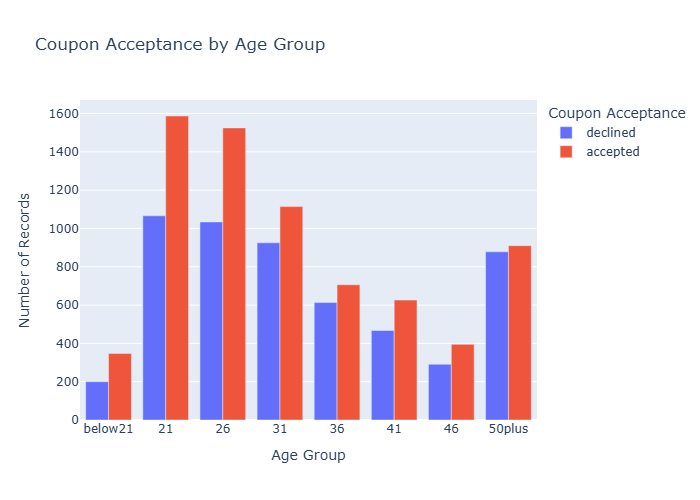
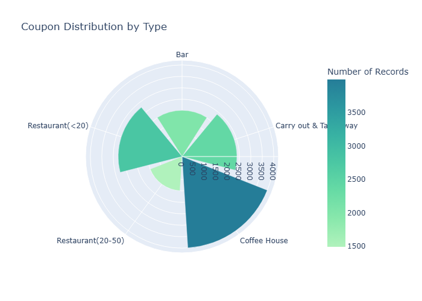
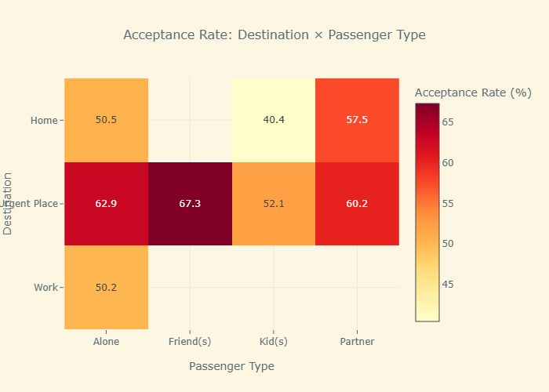

# Driver Coupon Acceptance Analysis Summary

## Problem Statement

This analysis investigates the factors that influence driver acceptance of mobile coupons for various venues including bars, restaurants, coffee houses, and other establishments. The primary research question is: **What demographic, behavioral, and contextual factors predict whether a driver will accept a coupon delivered via mobile device?**

The study aims to identify patterns in coupon acceptance behavior to enable targeted marketing strategies and improve coupon campaign effectiveness. Understanding these patterns can help businesses optimize their promotional strategies by targeting the most receptive customer segments.

## Summary of Descriptive and Inferential Results

### Overall Dataset Characteristics

- **Total Records**: 12,684 driver observations
- **Overall Acceptance Rate**: 56.84% of all coupons were accepted
- **Missing Data**: The `car` column had significant missing values (99.14%) and was removed from analysis
- **Coupon Types**: Bar, Restaurant(<20), Coffee House, Restaurant(20-50), Carry out & Take away

### Bar Coupons Investigation - Key Findings

#### 1. Overall Bar Coupon Performance
- **Acceptance Rate**: 41.00% of bar coupons were accepted
- Bar coupons had a lower acceptance rate compared to the overall average

#### 2. Bar Visit Frequency Impact
- **Infrequent visitors** (≤3 times/month): 37.06% acceptance rate
- **Frequent visitors** (>3 times/month): 73.18% acceptance rate
- **Key Insight**: Existing bar-going behavior is the strongest predictor of acceptance

#### 3. Age and Bar Frequency Combination
- **Target Group** (Bar >1x/month AND Age >25): 69.52% acceptance rate
- **All Others**: 33.50% acceptance rate
- **Difference**: +36.02 percentage points higher for the target group

#### 4. Social and Occupational Factors
- **Optimal Profile** (Bar >1x/month, No kids, Non-farming occupation): 71.32% acceptance rate
- **All Others**: 29.60% acceptance rate
- **Difference**: +41.72 percentage points higher for optimal profile

#### 5. Multiple Lifestyle Factors Analysis
Drivers meeting ANY of these conditions showed higher acceptance (60.54% vs 54.31%):
- Go to bars >1x/month, no kid passengers, not widowed
- Go to bars >1x/month and under 30
- Go to cheap restaurants >4x/month with income <$50K

### Independent Investigation - Destination and Passenger Analysis

#### 1. Destination Impact on Acceptance
- **No Urgent Place**: Highest acceptance rates (drivers with flexible schedules)
- **Home**: Moderate acceptance rates
- **Work**: Lower acceptance rates (time-constrained situations)

#### 2. Passenger Type Influence
- **Friend(s)**: Highest acceptance rates (~65-70%)
- **Partner**: Moderate-high acceptance rates
- **Alone**: Moderate acceptance rates
- **Kid(s)**: Lowest acceptance rates (~45-50%)

#### 3. Direction Convenience Factor
- **Same Direction**: 69.11% acceptance rate
- **Opposite Direction**: 44.05% acceptance rate
- **Difference**: +25.06 percentage points for same direction travel

#### 4. Combined Effects
The analysis revealed that acceptance rates are highest when multiple favorable conditions align:
- Traveling with friends + No urgent destination + Same direction = Optimal acceptance scenario
- Traveling with kids + Urgent destination + Opposite direction = Lowest acceptance scenario

## Visual Representations

### Key Visualizations Generated

*Figure 1: Coupon acceptance patterns across different age demographics, showing higher acceptance rates among younger drivers*

*Figure 2: Distribution of coupon types in the dataset, with Coffee House and Restaurant(<20) being most common*

*Figure 3: Acceptance rate heatmap showing the interaction between destination type and passenger composition*

## Actionable Items and Recommendations

### 1. Targeted Bar Coupon Campaigns

**High-Priority Segments:**
- **Primary Target**: Drivers aged 25+ who visit bars >1x/month
  - Expected acceptance rate: ~70%
  - Campaign focus: Premium bar experiences, happy hour specials

- **Secondary Target**: Young adults (<30) who visit bars regularly
  - Expected acceptance rate: ~60-65%
  - Campaign focus: Social events, group discounts

**Optimal Timing and Context:**
- Target drivers traveling in the same direction as the bar
- Focus on drivers without children as passengers
- Prioritize drivers with flexible schedules (no urgent destinations)

### 2. Cross-Venue Strategy

**Bundle Opportunities:**
- Combine bar coupons with cheap restaurant offers for budget-conscious frequent diners
- Target the overlap between bar-goers and affordable dining customers

**Avoid These Segments:**
- Drivers with children as passengers (45-50% acceptance vs 65-70% with friends)
- Drivers traveling opposite direction to venue (44% vs 69% same direction)
- Farming/forestry workers (lower social flexibility)

### 3. Social Context Optimization

**Friend-Focused Campaigns:**
- Develop group discounts and social promotions
- Time campaigns for social hours (evenings, weekends)
- Create shareable offers that encourage group visits

**Convenience-First Approach:**
- Implement location-based targeting to ensure same-direction travel
- Offer time-limited coupons for immediate use
- Provide clear directions and estimated travel time

### 4. Demographic Targeting Strategy

**Age-Based Segmentation:**
- **21-30**: Social experience focus, group activities
- **31-50**: Convenience and value focus, after-work specials
- **50+**: Quality and comfort focus, early evening promotions

**Income-Based Approach:**
- Target <$50K income drivers with value-oriented offers
- Combine with affordable dining options for maximum appeal

## Additional Modeling Ideas

### 1. Testing and Analysis

**A/B Testing:**
- Test different coupon designs and messaging
- Deliver coupons to a friend and partner's mobile device to perform A/B testing vs delivering coupons to driver
- Experiment with timing and delivery methods
- Measure long-term customer value impact

**Causal Analysis:**
- Analyze sales patterns for establishments that run promotions vs those that do not
- Analyze spillover effects on non-targeted customers
- How long before a user accepts a similar coupon again (accepts bar coupon on Monday and does not accept a new bar coupon again until the following week)

### 2. Real-Time Recommendation Systems

**Context-Aware Models:**
- Integrate real-time location data when coupon is delivered
- Consider current traffic conditions
- Factor in weekday and weekend/holiday segmentation

**Personalization Engines:**
- Build individual preference profiles
- Implement collaborative filtering for similar users

### 3. Economic and Business Impact Models

**ROI Optimization:**
- Model customer lifetime value impact
- Optimize coupon value vs. acceptance probability

**Market Expansion Models:**
- Identify opportunities to convert non-users, send kid friendly restaurant coupons to parents
- Analyze cross-selling and upselling opportunities

## Conclusion

The analysis reveals that coupon acceptance is primarily driven by **lifestyle compatibility**, **social context**, and **convenience factors**. The most successful coupon campaigns should target drivers who already exhibit the desired behavior (e.g., existing bar-goers for bar coupons), are in social situations that encourage spontaneous decisions, and face minimal inconvenience to redeem the offer.

The key insight is that coupons work best as **opportunistic social offers** rather than behavior-changing incentives. Future modeling efforts should focus on identifying these optimal moments and developing personalized, context-aware recommendation systems that maximize both acceptance rates and business value. 